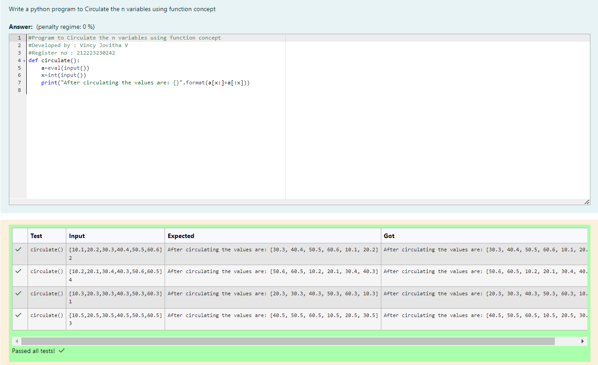

# Circulate-the-values-of-N-variables
## Aim:
To write a python program to circulate the n variables using function concept
## Equipment’s required:
PC
Anaconda - Python 3.7
## Algorithm: 
### Step 1: 
Define a function named circulate()
### Step 2: 
Get the elements of the list from the user
### Step 3: 
Get the value from the user for the number of rotation
### Step 4: 
Using the slicing concept rotate the list
### Step 5: 
Print the list after circulating the elements
### Step 6: 
End the program
## Program:
```
#Program to Circulate the n variables using function concept
#Developed by : Vincy Jovitha V
#Register no : 212223230242
def circulate():
    a=eval(input())
    x=int(input())
    print("After circulating the values are: {}".format(a[x:]+a[:x]))

```
## Output:


## Result:
Thus the values are circulated successfully.

